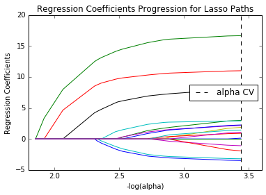

Imports


```python
%matplotlib inline
import pandas as pd
import numpy as np
import matplotlib.pylab as plt
from sklearn.cross_validation import train_test_split
from sklearn.linear_model import LassoLarsCV
import os
```


```python
#Load the dataset
columns = ["H1MO1","H1MO2","H1MO3","H1MO4","H1MO5","H1MO8","H1MO9","H1MO10","H1MO11","H1MO13","H1MO14","H1RE4","H1RE6","H1BC8","H1BC7","BIO_SEX","H1PF2","H1PF3","H1PF5","H1PF25"]


AH_data = pd.read_csv("../../data/addhealth_pds.csv", usecols=columns)

data_clean = AH_data.dropna()

#Removing refused, legitimate skip, don't know, and NA from variables.
for column in columns:
    data_clean = data_clean[~data_clean[column].isin([6,7,8,9])]

# Data Management
recode1 = {1:1, 2:0}
data_clean['MALE']= data_clean['BIO_SEX'].map(recode1)
```


```python
data_clean.dtypes
```


    BIO_SEX     int64
    H1MO1       int64
    H1MO2       int64
    H1MO3       int64
    H1MO4       int64
    H1MO5       int64
    H1MO8       int64
    H1MO9       int64
    H1MO10      int64
    H1MO11      int64
    H1MO13      int64
    H1MO14      int64
    H1PF2       int64
    H1PF3       int64
    H1PF5       int64
    H1BC7       int64
    H1BC8       int64
    H1RE4       int64
    H1RE6       int64
    AGE        object
    MALE        int64
    dtype: object


```python
#select predictor variables and target variable as separate data sets  
predvar= data_clean[["H1MO1","H1MO2","H1MO4","H1MO5","H1MO8","H1MO9","H1MO10","H1MO11","H1MO13","H1MO14","H1RE4","H1RE6","H1BC8","H1BC7","MALE","H1PF2","H1PF3","H1PF5","H1PF25"]]

target = data_clean.H1MO3
 
# standardize predictors to have mean=0 and sd=1
predictors=predvar.copy()
from sklearn import preprocessing

for column in predvar.columns:
    predictors[column]=preprocessing.scale(predictors[column].astype('float64'))

# split data into train and test sets
pred_train, pred_test, tar_train, tar_test = train_test_split(predictors, target, 
                                                              test_size=.3, random_state=123)

# specify the lasso regression model
model=LassoLarsCV(cv=10, precompute=False).fit(pred_train,tar_train)

# print variable names and regression coefficients
var_imp = pd.DataFrame(data = {'predictors':list(predictors.columns.values),'coefficients':model.coef_})
var_imp['sort'] = var_imp.coefficients.abs()
                   
print(var_imp.sort_values(by='sort', ascending=False))
```

        coefficients predictors      sort
    1       0.410922      H1MO2  0.410922
    2       0.266673      H1MO4  0.266673
    6       0.196177     H1MO10  0.196177
    0      -0.085100      H1MO1  0.085100
    3      -0.079051      H1MO5  0.079051
    8       0.073324     H1MO13  0.073324
    10      0.069944      H1RE4  0.069944
    14      0.054742       MALE  0.054742
    11      0.052016      H1RE6  0.052016
    9      -0.047000     H1MO14  0.047000
    12      0.045386      H1BC8  0.045386
    17      0.034549      H1PF5  0.034549
    4      -0.026845      H1MO8  0.026845
    18      0.026129     H1PF25  0.026129
    16      0.022001      H1PF3  0.022001
    7       0.002930     H1MO11  0.002930
    5       0.000000      H1MO9  0.000000
    13      0.000000      H1BC7  0.000000
    15      0.000000      H1PF2  0.000000


```python
print(pred_test.shape)
print(pred_train.shape)
```

    (727, 19)
    (1696, 19)


```python
# plot coefficient progression
m_log_alphas = -np.log10(model.alphas_)
ax = plt.gca()
plt.plot(m_log_alphas, model.coef_path_.T)
plt.axvline(-np.log10(model.alpha_), linestyle='--', color='k',
            label='alpha CV')
plt.ylabel('Regression Coefficients')
plt.xlabel('-log(alpha)')
plt.title('Regression Coefficients Progression for Lasso Paths')
plt.legend(loc=5)
```


    <matplotlib.legend.Legend at 0x7f1df9d38550>





```python
# plot mean square error for each fold
m_log_alphascv = -np.log10(model.cv_alphas_)
plt.figure()
plt.plot(m_log_alphascv, model.cv_mse_path_, ':')
plt.plot(m_log_alphascv, model.cv_mse_path_.mean(axis=-1), 'k',
         label='Average across the folds', linewidth=2)
plt.axvline(-np.log10(model.alpha_), linestyle='--', color='k',
            label='alpha CV')
plt.legend()
plt.xlabel('-log(alpha)')
plt.ylabel('Mean squared error')
plt.title('Mean squared error on each fold')
```


    <matplotlib.text.Text at 0x7f1df9cf9780>


```python
# MSE from training and test data
from sklearn.metrics import mean_squared_error
train_error = mean_squared_error(tar_train, model.predict(pred_train))
test_error = mean_squared_error(tar_test, model.predict(pred_test))
print ('training data MSE')
print(train_error)
print ('test data MSE')
print(test_error)

# R-square from training and test data
rsquared_train=model.score(pred_train,tar_train)
rsquared_test=model.score(pred_test,tar_test)
print ('training data R-square')
print(rsquared_train)
print ('test data R-square')
print(rsquared_test)
```

    training data MSE
    0.885524499353
    test data MSE
    0.861332065056
    training data R-square
    0.406762811189
    test data R-square
    0.461459595169


```python
predictors.columns.values.size
```


    19


