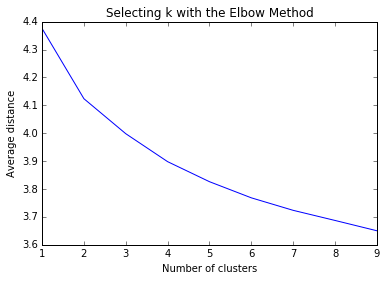
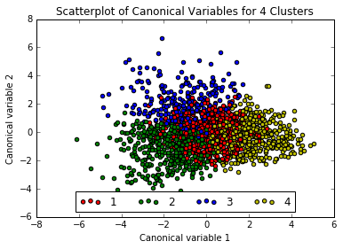
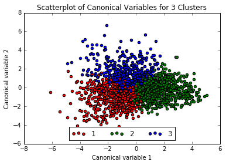

# K-means clustering

Clustering groups into similar groups to reduce variance within clusters and increase variance between clusters. Can be used to identify groupings of similar responses (such as for marketing or health-care) or to reduce the number of variables. Cluster analysis is unsupervised: no specific response variable. K-means separates data into an *a priori* number of *n* distinct groups by minimizing a distance parameter within clusters. 

## Limitations
1. A priori, subjective, specification of clusters.
2. Results can change based on initial location of centroids from start of clusterin
3. Not recommended for lots of categorical variables
4. Assumes clusters are spherical, distinct, and approximately equal in size

Conducting k-means clustering with multiple k values can help mitigate 1 and 4. Splitting data into training and test sets shows whether clusters are reliable (2) as well as validation on variables omitted from the clustering process.

For geospatial clustering of points, clustering on the size of each cluster using a [hierarchical clustering method](https://en.wikipedia.org/wiki/Hierarchical_clustering) might be a better idea since the number of distinct clusters is not known *a priori*, while cluster diameter may have a logical size, see [my example in PostGIS](http://gis.stackexchange.com/a/144230/36886)


# Continuing to examine factors leading teenagers to have sex

Previously in the Wesleyan Machine Learning course I worked with the Add Health dataset to examine which factors were good predictors of a teen having had sex. Since the degree to which  someone would agree with "If you had sexual intercourse, afterward, you would feel guilty" was the most important predictor, in the third assignment I examined what variables were strong predictors of this feeling of sexual guilt using LASSO regression. A weakness of LASSO regression is that it doesn't identify which variables are correlated, so some variables which were ultimately discounted in the model may help us get a better sense of who is liable to experience sexual guilt. This analysis will attempt to cluster individuals to see which combinations of factor explain a likelihood to express sexual guilt.

## Imports
Not the first line, which makes plots appear within the notebook


```python
%matplotlib inline
from pandas import Series, DataFrame
import pandas as pd
import numpy as np
import matplotlib.pylab as plt
from sklearn.cross_validation import train_test_split
from sklearn import preprocessing
from sklearn.cluster import KMeans
```

## Data Management

Loading columns, recoding sex, and removing rows with unacceptable responses. Then splitting into training set


```python
#Load the dataset
columns = ["H1CO1","H1MO1","H1MO2","H1MO3","H1MO4","H1MO5","H1MO8","H1MO9","H1MO10","H1MO11","H1MO13","H1MO14","H1RE4","H1RE6","H1BC8","H1BC7","BIO_SEX","H1PF2","H1PF3","H1PF5","H1PF25"]


AH_data = pd.read_csv("../../data/addhealth_pds.csv", usecols=columns)

data_clean = AH_data.dropna()

recode1 = {1:1, 2:0}
data_clean['MALE']= data_clean['BIO_SEX'].map(recode1)

data_clean.drop('BIO_SEX',axis=1,inplace=True)
columns.remove('BIO_SEX')

#Removing refused, legitimate skip, don't know, and NA from variables

for column in columns:
    data_clean = data_clean[~data_clean[column].isin([6,7,8,9])]
cluster = data_clean.copy()

#then standardize clustering variables to have mean=0 and sd=1
for column in columns:
    data_clean[column]=preprocessing.scale(data_clean[column].astype('float64'))

# split data into train and test sets
clus_train, clus_test = train_test_split(data_clean, test_size=.3, random_state=123)

print(data_clean.shape)
print(clus_train.shape)
```

    (2413, 21)
    (1689, 21)


## Clustering

Running k-means cluster analysis for 1-9 clusters on training set of 1689 observations.


```python
from scipy.spatial.distance import cdist
clusters=range(1,10)
meandist=[]

for k in clusters:
    model=KMeans(n_clusters=k)
    model.fit(clus_train)
    #Adding average euclidean distance between the model.cluster_centers_, the cluster centroids from the model results, to array.
    meandist.append(sum(np.min(cdist(clus_train, model.cluster_centers_, 'euclidean'), axis=1)) 
    / clus_train.shape[0])
```

### Plotting
Plotting the average distance from observations from the cluster centroid to use the Elbow Method to identify number of clusters to choose. We want to see where the line kinks and marginal benefit of additional clusters in reducing average distance decreases dramatically. 


```python
plt.plot(clusters, meandist)
plt.xlabel('Number of clusters')
plt.ylabel('Average distance')
plt.title('Selecting k with the Elbow Method')
```


    <matplotlib.text.Text at 0x7f8450172748>





The plot above appears quite smooth, so will select k=4 as the "ideal" number of clusters. 
Now running **Canonical Discriminant Analysis** which reduces number of variables to linear combinations of clustering variables in order to plot them on a two-dimensional axis. 
## Interpreting the 4 Cluster Solution


```python
model4=KMeans(n_clusters=4)
model4.fit(clus_train)
# plot clusters

from sklearn.decomposition import PCA
pca_2 = PCA(2)
pca_data = pca_2.fit_transform(clus_train)

#Merge pca results with cluster_ids for future reference
#pca_clusters = pd.DataFrame({'x':plot_columns[:,0],'y':plot_columns[:,1],'cluster':model4.labels_[:]})

#Adding a legend with labels
colors= ['r','g','b','y']

#Create empty array of objects to receive plots
c = [None] * 4

for i in range(0, plot_columns.shape[0]):
    c[model4.labels_[i]] =  plt.scatter(x=plot_columns[i,0], y=plot_columns[i,1], c=colors[model4.labels_[i]],label=model4.labels_[i])
plt.xlabel('Canonical variable 1')
plt.ylabel('Canonical variable 2')
plt.legend(c, ['1','2','3','4'],loc='lower center',ncol=4)
plt.title('Scatterplot of Canonical Variables for 4 Clusters')
plt.show()
```





The three exterior clusters appear somewhat distinct, however the center cluster (1, in red) muddles into the other, so will rerun the above with only 3 clusters.


```python
model3=KMeans(n_clusters=3)
model3.fit(clus_train)
#Create empty array of objects to receive plots
c = [None] * 3

for i in range(0, plot_columns.shape[0]):
    c[model3.labels_[i]] =  plt.scatter(x=plot_columns[i,0], y=plot_columns[i,1], c=colors[model3.labels_[i]],label=model3.labels_[i])
plt.xlabel('Canonical variable 1')
plt.ylabel('Canonical variable 2')
plt.legend(c, ['1','2','3'],loc='lower center',ncol=3)
plt.title('Scatterplot of Canonical Variables for 3 Clusters')
plt.show()
```





That looks a little better no?
Now adding the clusters to the training dataframe. Much easier to understand than the mess of code the instructor gave


```python
clus_train.loc[:,'cluster'] = model3.labels_
```

    /home/rad/python3-courses/lib/python3.5/site-packages/pandas/core/indexing.py:288: SettingWithCopyWarning: 
    A value is trying to be set on a copy of a slice from a DataFrame.
    Try using .loc[row_indexer,col_indexer] = value instead
    
    See the caveats in the documentation: http://pandas.pydata.org/pandas-docs/stable/indexing.html#indexing-view-versus-copy
      self.obj[key] = _infer_fill_value(value)
    /home/rad/python3-courses/lib/python3.5/site-packages/pandas/core/indexing.py:549: SettingWithCopyWarning: 
    A value is trying to be set on a copy of a slice from a DataFrame.
    Try using .loc[row_indexer,col_indexer] = value instead
    
    See the caveats in the documentation: http://pandas.pydata.org/pandas-docs/stable/indexing.html#indexing-view-versus-copy
      self.obj[item_labels[indexer[info_axis]]] = value


```python
# cluster frequencies
clus_train.cluster.value_counts()
```


    1    715
    0    512
    2    462
    Name: cluster, dtype: int64


FINALLY calculate clustering variable means by cluster


```python
clustergrp = clus_train.groupby('cluster').mean()
print ("Clustering variable means by cluster")
#To force the printing of all columns, though it doesn't matter since we're printing the transpose of the dataframe (T)
with pd.option_context('display.max_columns', 999):
    print(clustergrp.T)
```

    Clustering variable means by cluster
    cluster         0         1         2
    H1MO1   -0.196175  0.325884 -0.232385
    H1MO2    0.431562 -0.365259  0.168527
    H1MO3    0.551782 -0.603857  0.301994
    H1MO4    0.712848 -0.490012  0.014538
    H1MO5   -0.115741  0.306683 -0.311363
    H1MO8   -0.125019  0.219771 -0.171571
    H1MO9    0.989249 -0.484580 -0.275395
    H1MO10   1.054328 -0.581606 -0.194684
    H1MO11   0.422043 -0.277137 -0.032975
    H1MO13   0.570398 -0.378552 -0.019786
    H1MO14   0.281263 -0.165829 -0.031223
    H1PF2   -0.224967 -0.268208  0.682032
    H1PF3   -0.245561 -0.353718  0.809515
    H1PF5   -0.269234 -0.400254  0.813537
    H1PF25  -0.071671 -0.320834  0.562733
    H1CO1    0.512716 -0.482802  0.128632
    H1BC7    0.054666 -0.070309  0.084138
    H1BC8    0.179815 -0.132900  0.072834
    H1RE4   -0.033861 -0.410558  0.691140
    H1RE6    0.001017 -0.351803  0.550173
    MALE     0.552734  0.440559  0.506494


Since all of the variables except gender have been normalized, the absolute value of the means gives an indication of how far each cluster is from the mean of each variable. The gender variable is 1 if male and 0 if female, so values below 0.5 mean a cluster has a greater proportion of female teenagers, and above signifies a greater proportion of male teenagers. Cluster 0 seems slightly more Male, cluster 1 is slightly more female, cluster 2 is an even split.

 - Cluster 0 (N = 512) appears to be teenagers who tend slightly to be male, who have had sex (H1CO1) who do not feel guilty (H1MO3) and who's mothers would not be upset (H1M04) and who wouldn't be embarrassed if they got someone pregnant (H1MO9, H1MO10).
 - Cluster 1 (N = 715) appears to be teenagers who tend slightly to be female, who have not had sex (H1CO1) who would feel guilty (H1MO3) and who's mothers would be upset (H1M04). They would be embarrassed if they got someone pregnant (H1MO9, H1MO10). 
 - Cluster 2 (N = 462) is an even gender mix with a slight tendency to have had sex over the average and a tendency to feel less  guilty than average after having sex (though slighter than cluster 0). Interestingly, this group tends to have a less satisfactory relationship than average with their mothers (H1PF5) who tend not to promote their independence (H1PF2) nor assists them in understanding their errors when they do something wrong (H1PF3). The other two strong variables in this cluster indicate these teens find religion to be less important than average (H1RE4), and pray less frequently than average (H1RE6).


## Validation
Validate clusters in training data by examining cluster differences in GPA using ANOVA. 

**Note: strangely enough my version of the Add Health dataset didn't have a GPA column... weird. The code below is how I would have done it though...**


```python
# first have to merge GPA with clustering variables and cluster assignment data 
gpa_data=data_clean['GPA1']
# split GPA data into train and test sets
gpa_train, gpa_test = train_test_split(gpa_data, test_size=.3, random_state=123)
gpa_train1=pd.DataFrame(gpa_train)
gpa_train1.reset_index(level=0, inplace=True)
merged_train_all=pd.merge(gpa_train1, merged_train, on='index')
sub1 = merged_train_all[['GPA1', 'cluster']].dropna()

import statsmodels.formula.api as smf
import statsmodels.stats.multicomp as multi 

gpamod = smf.ols(formula='GPA1 ~ C(cluster)', data=sub1).fit()
print (gpamod.summary())

print ('means for GPA by cluster')
m1= sub1.groupby('cluster').mean()
print (m1)

print ('standard deviations for GPA by cluster')
m2= sub1.groupby('cluster').std()
print (m2)

mc1 = multi.MultiComparison(sub1['GPA1'], sub1['cluster'])
res1 = mc1.tukeyhsd()
print(res1.summary())
```
